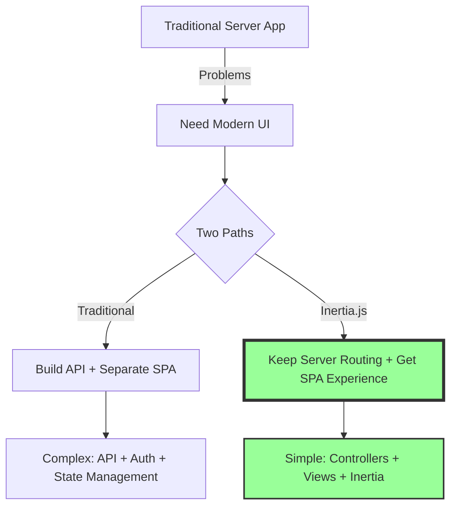
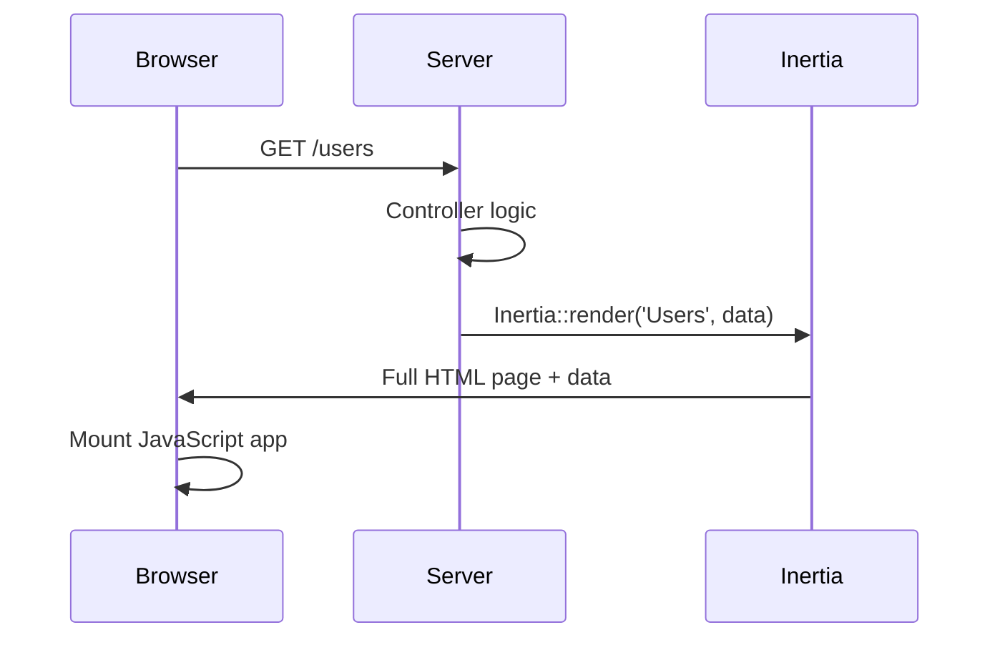
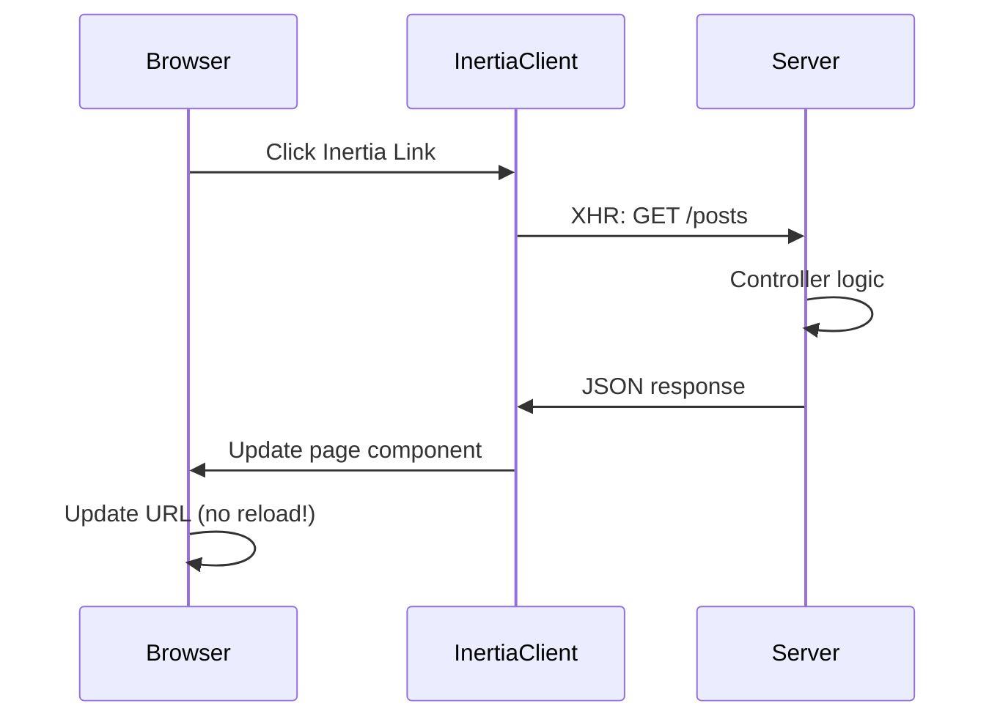

# 🌉 How Inertia.js Really Works - The Modern Monolith Explained

## 📚 Table of Contents
1. [What is Inertia.js?](#what-is-inertiajs)
2. [The Problem Inertia Solves](#the-problem-inertia-solves)
3. [How Inertia.js Works Under the Hood](#how-inertiajs-works-under-the-hood)
4. [Inertia.js with Different Frameworks](#inertiajs-with-different-frameworks)
5. [Setting Up Inertia.js](#setting-up-inertiajs)
6. [Inertia.js + Svelte vs Inertia.js + React](#inertiajs--svelte-vs-inertiajs--react)
7. [Real-World Benefits](#real-world-benefits)

---

## 🤔 What is Inertia.js?

Inertia.js is a **protocol and set of adapters** that allows you to build modern single-page applications (SPAs) using **classic server-side routing and controllers**.

### **The Bridge Between Worlds**



### **Key Concept: The Modern Monolith**
- **Monolith**: Your entire app (frontend + backend) in one codebase
- **Modern**: SPA-like user experience with no page refreshes
- **Simple**: No API to build, no client-side state management complexity

---

## 🎯 The Problem Inertia Solves

### **Traditional Web Apps:**
```php
// Laravel Controller
class UserController {
    public function index() {
        $users = User::all();
        return view('users.index', ['users' => $users]);
    }
}
```
```blade
<!-- Blade Template -->
@foreach ($users as $user)
    <div>{{ $user->name }}</div>
@endforeach
```
**Problem**: Full page reloads, not modern feeling

### **Modern SPA Approach:**
```php
// API Controller
class UserApiController {
    public function index() {
        return User::all(); // Returns JSON
    }
}
```
```javascript
// React/Vue/Svelte App
fetch('/api/users')
    .then(res => res.json())
    .then(users => setUsers(users));
```
**Problem**: Need to build API, handle auth, manage state, two codebases

### **Inertia.js Solution:**
```php
// Same Controller, but with Inertia
class UserController {
    public function index() {
        return Inertia::render('Users/Index', [
            'users' => User::all()
        ]);
    }
}
```
```svelte
<!-- Svelte Component receives data as props -->
<script>
  let { users } = $props();
</script>

{#each users as user}
  <div>{user.name}</div>
{/each}
```
**Solution**: Keep server-side simplicity, get SPA experience!

---

## ⚙️ How Inertia.js Works Under the Hood

### **1. Initial Page Load**



**What happens:**
1. Browser requests `/users`
2. Server runs controller, prepares data
3. Server returns full HTML page with embedded JSON data
4. JavaScript framework (Svelte/React/Vue) takes over

### **2. Subsequent Navigation**



**What happens:**
1. User clicks an Inertia link
2. Inertia intercepts click, makes XHR request
3. Server returns JSON (not HTML)
4. Inertia swaps the page component
5. URL updates without page reload

### **3. The Protocol**

**Initial Request (Regular HTTP):**
```http
GET /users HTTP/1.1
Accept: text/html
```

**Response (Full HTML):**
```html
<!DOCTYPE html>
<html>
<head>
    <title>Users</title>
</head>
<body>
    <div id="app" data-page='{
        "component": "Users/Index",
        "props": {
            "users": [...]
        }
    }'></div>
    <script src="/app.js"></script>
</body>
</html>
```

**Subsequent Request (Inertia XHR):**
```http
GET /posts HTTP/1.1
X-Inertia: true
X-Inertia-Version: 1234567890
Accept: application/json
```

**Response (JSON only):**
```json
{
    "component": "Posts/Index",
    "props": {
        "posts": [...]
    },
    "url": "/posts",
    "version": "1234567890"
}
```

---

## 🔄 Inertia.js with Different Frameworks

### **The Beauty: Same Backend, Different Frontend**

```php
// This Laravel controller works with ANY frontend framework
class PostController {
    public function show($id) {
        return Inertia::render('Posts/Show', [
            'post' => Post::find($id),
            'comments' => Comment::where('post_id', $id)->get()
        ]);
    }
}
```

### **Frontend Implementations:**

**1. Svelte Implementation:**
```svelte
<!-- Pages/Posts/Show.svelte -->
<script>
  let { post, comments } = $props();
</script>

<h1>{post.title}</h1>
<p>{post.content}</p>

{#each comments as comment}
  <div>{comment.text}</div>
{/each}
```

**2. React Implementation:**
```jsx
// Pages/Posts/Show.jsx
export default function Show({ post, comments }) {
  return (
    <>
      <h1>{post.title}</h1>
      <p>{post.content}</p>
      
      {comments.map(comment => (
        <div key={comment.id}>{comment.text}</div>
      ))}
    </>
  );
}
```

**3. Vue Implementation:**
```vue
<!-- Pages/Posts/Show.vue -->
<template>
  <div>
    <h1>{{ post.title }}</h1>
    <p>{{ post.content }}</p>
    
    <div v-for="comment in comments" :key="comment.id">
      {{ comment.text }}
    </div>
  </div>
</template>

<script setup>
defineProps(['post', 'comments']);
</script>
```

---

## 🚀 Setting Up Inertia.js

### **Backend Setup (Laravel Example)**

**1. Install Server-Side Adapter:**
```bash
composer require inertiajs/inertia-laravel
```

**2. Create Middleware:**
```bash
php artisan inertia:middleware
```

**3. Add to Kernel:**
```php
// app/Http/Kernel.php
'web' => [
    // ... other middleware
    \App\Http\Middleware\HandleInertiaRequests::class,
],
```

**4. Create Root Template:**
```blade
<!-- resources/views/app.blade.php -->
<!DOCTYPE html>
<html>
<head>
    <meta charset="utf-8">
    <meta name="viewport" content="width=device-width, initial-scale=1">
    @vite(['resources/js/app.js'])
    @inertiaHead
</head>
<body>
    @inertia
</body>
</html>
```

### **Frontend Setup**

**For Svelte:**
```bash
npm install @inertiajs/svelte
```

```javascript
// resources/js/app.js
import { createInertiaApp } from '@inertiajs/svelte';

createInertiaApp({
  resolve: name => {
    const pages = import.meta.glob('./Pages/**/*.svelte', { eager: true });
    return pages[`./Pages/${name}.svelte`];
  },
  setup({ el, App, props }) {
    new App({ target: el, props });
  },
});
```

**For React:**
```bash
npm install @inertiajs/react
```

```javascript
// resources/js/app.js
import { createInertiaApp } from '@inertiajs/react';
import { createRoot } from 'react-dom/client';

createInertiaApp({
  resolve: name => {
    const pages = import.meta.glob('./Pages/**/*.jsx', { eager: true });
    return pages[`./Pages/${name}.jsx`];
  },
  setup({ el, App, props }) {
    const root = createRoot(el);
    root.render(<App {...props} />);
  },
});
```

---

## 🆚 Inertia.js + Svelte vs Inertia.js + React

### **Bundle Size Comparison**

| Framework | Inertia Adapter | Framework Size | Total Bundle |
|-----------|----------------|----------------|--------------|
| Svelte    | ~15KB          | ~10KB          | ~25KB        |
| React     | ~15KB          | ~45KB          | ~60KB        |
| Vue 3     | ~15KB          | ~34KB          | ~49KB        |

### **Development Experience**

**Svelte + Inertia:**
```svelte
<script>
  import { router } from '@inertiajs/svelte';
  
  let { user } = $props();
  let editing = $state(false);
  
  function save() {
    router.put(`/users/${user.id}`, user);
  }
</script>

{#if editing}
  <input bind:value={user.name} />
  <button onclick={save}>Save</button>
{:else}
  <p>{user.name}</p>
  <button onclick={() => editing = true}>Edit</button>
{/if}
```

**React + Inertia:**
```jsx
import { useState } from 'react';
import { router } from '@inertiajs/react';

export default function User({ user: initialUser }) {
  const [user, setUser] = useState(initialUser);
  const [editing, setEditing] = useState(false);
  
  function save() {
    router.put(`/users/${user.id}`, user);
  }
  
  if (editing) {
    return (
      <>
        <input 
          value={user.name} 
          onChange={e => setUser({...user, name: e.target.value})}
        />
        <button onClick={save}>Save</button>
      </>
    );
  }
  
  return (
    <>
      <p>{user.name}</p>
      <button onClick={() => setEditing(true)}>Edit</button>
    </>
  );
}
```

### **Key Differences:**
1. **Bundle Size**: Svelte produces smaller bundles
2. **Syntax**: Svelte is more concise and HTML-like
3. **Reactivity**: Svelte's runes vs React's hooks
4. **Performance**: Svelte has no virtual DOM overhead

---

## 💡 Real-World Benefits

### **1. No API to Build**
```php
// Traditional: Need both web and API routes
Route::get('/users', [UserController::class, 'index']); // Web
Route::get('/api/users', [UserApiController::class, 'index']); // API

// Inertia: Just one route
Route::get('/users', [UserController::class, 'index']); // Works for both!
```

### **2. Authentication Simplified**
```php
// Your existing Laravel auth works perfectly
Route::middleware(['auth'])->group(function () {
    Route::get('/dashboard', [DashboardController::class, 'index']);
});

// No JWT tokens, no OAuth complexity for your SPA!
```

### **3. SEO-Friendly by Default**
- Server-side rendering available
- Proper meta tags and OpenGraph support
- Search engines see full content

### **4. File Uploads Made Easy**
```svelte
<script>
  import { router } from '@inertiajs/svelte';
  
  function submit(e) {
    const formData = new FormData(e.target);
    router.post('/upload', formData);
  }
</script>

<form onsubmit|preventDefault={submit}>
  <input type="file" name="avatar" />
  <button type="submit">Upload</button>
</form>
```

### **5. Validation Handling**
```php
// Laravel Controller
public function store(Request $request) {
    $request->validate([
        'title' => 'required|max:255',
        'content' => 'required'
    ]);
    
    // Validation errors automatically sent to frontend!
}
```

```svelte
<!-- Svelte Component -->
<script>
  let { errors = {} } = $props();
</script>

<input type="text" name="title" />
{#if errors.title}
  <span class="error">{errors.title}</span>
{/if}
```

---

## 🎓 When to Use Inertia.js

### **Perfect For:**
- ✅ Teams familiar with server-side frameworks (Laravel, Rails)
- ✅ Apps that need modern UI without API complexity
- ✅ Projects where SEO matters
- ✅ Rapid prototyping and MVPs
- ✅ Admin panels and dashboards

### **Not Ideal For:**
- ❌ Mobile apps (need real API)
- ❌ Public APIs for third parties
- ❌ Microservices architecture
- ❌ Real-time features (use with websockets)

---

## 📚 Key Takeaways

1. **Inertia.js is a Protocol**: Not a framework, but a way to connect backend and frontend
2. **No API Needed**: Use your server-side framework's routing and controllers
3. **Framework Agnostic**: Works with React, Vue, or Svelte
4. **SPA Experience**: Get all benefits of SPAs without the complexity
5. **Progressive Enhancement**: Can add to existing apps gradually

---

## 🔗 Resources

- **Official Docs**: [inertiajs.com](https://inertiajs.com)
- **Protocol Spec**: [inertiajs.com/the-protocol](https://inertiajs.com/the-protocol)
- **Our Patterns**: See `svelte5-inertia-patterns-markdown/README.md`
- **Video Course**: [Laracasts Inertia.js Course](https://laracasts.com/series/build-modern-laravel-apps-using-inertia-js)

---

**Remember**: Inertia.js lets you build modern apps the way you already know how - with server-side routing and controllers, but with a fantastic SPA user experience! 