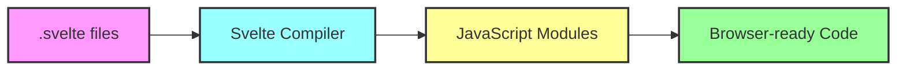

# 🎯 How Svelte 5 Really Works - A Beginner's Guide

## 📚 Table of Contents
1. [What is Svelte 5?](#what-is-svelte-5)
2. [How Svelte 5 Works in Isolation](#how-svelte-5-works-in-isolation)
3. [Svelte 5's Revolutionary Runes](#svelte-5s-revolutionary-runes)
4. [Svelte 5 vs Other Frameworks](#svelte-5-vs-other-frameworks)
5. [Svelte 5 with Inertia.js](#svelte-5-with-inertiajs)
6. [Key Differences in Setup](#key-differences-in-setup)

---

## 🤔 What is Svelte 5?

Svelte 5 is a **compiler-based frontend framework** that transforms your components into vanilla JavaScript at build time. Unlike React or Vue that ship a runtime to the browser, Svelte compiles away, leaving you with pure, optimized JavaScript.

### **The Compiler Magic**
```svelte
<!-- What you write (Svelte component) -->
<script>
  let count = $state(0);
  
  function increment() {
    count++;
  }
</script>

<button onclick={increment}>
  Clicks: {count}
</button>
```

```javascript
// What Svelte compiles it to (simplified)
let count = 0;
const button = document.createElement('button');

function updateButton() {
  button.textContent = `Clicks: ${count}`;
}

button.onclick = () => {
  count++;
  updateButton();
};

updateButton();
```

---

## 🔧 How Svelte 5 Works in Isolation

### **1. Component-Based Architecture**

Svelte components are `.svelte` files containing three optional sections:

```svelte
<!-- MyComponent.svelte -->

<!-- 1. JavaScript Logic -->
<script>
  // Component logic goes here
  let name = $state('World');
</script>

<!-- 2. HTML Template -->
<h1>Hello {name}!</h1>
<input bind:value={name} />

<!-- 3. Component Styles (scoped by default) -->
<style>
  h1 {
    color: purple;
  }
</style>
```

### **2. The Compilation Process**



### **3. No Virtual DOM**

Unlike React or Vue, Svelte doesn't use a Virtual DOM:

```javascript
// React (Virtual DOM approach)
// 1. Creates virtual representation
// 2. Diffs with previous virtual tree
// 3. Updates real DOM

// Svelte (Direct DOM manipulation)
// 1. Knows exactly what changed at compile time
// 2. Generates code to update only that specific part
// 3. No runtime overhead
```

---

## ⚡ Svelte 5's Revolutionary Runes

Svelte 5 introduces "runes" - a new reactivity system that's more explicit and powerful:

### **1. `$state` - Reactive State**
```svelte
<script>
  // Old Svelte 4 way
  let count = 0; // Automatically reactive
  
  // New Svelte 5 way
  let count = $state(0); // Explicitly reactive
  
  // Why the change? More predictable and works everywhere!
</script>
```

### **2. `$derived` - Computed Values**
```svelte
<script>
  let price = $state(100);
  let quantity = $state(2);
  
  // Automatically updates when price or quantity changes
  let total = $derived(price * quantity);
</script>

<p>Total: ${total}</p>
```

### **3. `$effect` - Side Effects**
```svelte
<script>
  let count = $state(0);
  
  // Runs whenever count changes
  $effect(() => {
    console.log(`Count is now: ${count}`);
    
    // Optional cleanup function
    return () => {
      console.log('Cleaning up...');
    };
  });
</script>
```

### **4. `$props` - Component Props**
```svelte
<script>
  // Parent passes props
  let { name, age = 18 } = $props();
</script>

<p>{name} is {age} years old</p>
```

---

## 🆚 Svelte 5 vs Other Frameworks

### **Compilation Differences**

| Aspect | Svelte 5 | React | Vue |
|--------|----------|-------|-----|
| **Approach** | Compiler | Runtime | Runtime |
| **Bundle Size** | Tiny (~10KB) | Large (~45KB) | Medium (~34KB) |
| **Virtual DOM** | No | Yes | Yes |
| **Reactivity** | Compile-time | Runtime hooks | Runtime proxy |

### **Code Comparison**

**Counter Component in Different Frameworks:**

```svelte
<!-- Svelte 5 -->
<script>
  let count = $state(0);
</script>

<button onclick={() => count++}>
  Count: {count}
</button>
```

```jsx
// React
import { useState } from 'react';

function Counter() {
  const [count, setCount] = useState(0);
  
  return (
    <button onClick={() => setCount(count + 1)}>
      Count: {count}
    </button>
  );
}
```

```vue
<!-- Vue 3 -->
<template>
  <button @click="count++">
    Count: {{ count }}
  </button>
</template>

<script setup>
import { ref } from 'vue';
const count = ref(0);
</script>
```

---

## 🔗 Svelte 5 with Inertia.js

### **What Changes with Inertia.js?**

When using Svelte with Inertia.js, the main difference is how components are loaded and how data flows:

### **1. Standard Svelte App Structure**
```javascript
// main.js - Traditional Svelte app
import App from './App.svelte';

const app = new App({
  target: document.body,
  props: {
    name: 'world'
  }
});
```

### **2. Svelte + Inertia.js Structure**
```javascript
// app.js - Inertia.js setup
import { createInertiaApp } from '@inertiajs/svelte';

createInertiaApp({
  resolve: name => {
    // Dynamic page component loading
    const pages = import.meta.glob('./Pages/**/*.svelte', { eager: true });
    return pages[`./Pages/${name}.svelte`];
  },
  setup({ el, App, props }) {
    new App({ target: el, props });
  },
});
```

### **Key Differences:**

1. **Page Components vs App Component**
   - **Standard Svelte**: Single root App component with client-side routing
   - **With Inertia**: Multiple page components, server controls routing

2. **Data Flow**
   - **Standard Svelte**: Fetch data from APIs in components
   - **With Inertia**: Receive data as props from server

3. **Navigation**
   - **Standard Svelte**: Client-side router (like svelte-routing)
   - **With Inertia**: Server-side routing with SPA-like experience

### **Example Page Component with Inertia.js:**
```svelte
<!-- Pages/Users/Index.svelte -->
<script>
  import { Link } from '@inertiajs/svelte';
  
  // Props come from the server
  let { users } = $props();
</script>

<h1>Users</h1>

{#each users as user}
  <div>
    <!-- Inertia Link for SPA navigation -->
    <Link href="/users/{user.id}">{user.name}</Link>
  </div>
{/each}
```

---

## 🛠️ Key Differences in Setup

### **1. Build Configuration**

**Standard Svelte Project:**
```javascript
// vite.config.js
import { defineConfig } from 'vite';
import { svelte } from '@sveltejs/vite-plugin-svelte';

export default defineConfig({
  plugins: [svelte()]
});
```

**Svelte + Inertia.js + Laravel:**
```javascript
// vite.config.js
import { defineConfig } from 'vite';
import { svelte } from '@sveltejs/vite-plugin-svelte';
import laravel from 'laravel-vite-plugin';

export default defineConfig({
  plugins: [
    laravel({
      input: ['resources/js/app.js'],
      refresh: true,
    }),
    svelte({
      compilerOptions: {
        // Important for Inertia.js compatibility
        compatibility: {
          componentApi: 4
        }
      }
    })
  ]
});
```

### **2. Entry Point Differences**

**Standard Svelte:**
```javascript
// Single component mounted to DOM
import App from './App.svelte';
new App({ target: document.body });
```

**With Inertia.js:**
```javascript
// Dynamic component resolution based on server response
createInertiaApp({
  resolve: name => {
    // Server tells which component to load
    return import(`./Pages/${name}.svelte`);
  }
});
```

### **3. Props and Data Management**

**Standard Svelte:**
```svelte
<script>
  import { onMount } from 'svelte';
  
  let users = $state([]);
  
  onMount(async () => {
    // Fetch data from API
    const response = await fetch('/api/users');
    users = await response.json();
  });
</script>
```

**With Inertia.js:**
```svelte
<script>
  // Data comes as props from server
  let { users } = $props();
  // No need to fetch - already have the data!
</script>
```

---

## 🎓 Key Takeaways

### **When to Use Svelte 5 Alone:**
- Building a pure SPA with client-side routing
- Creating static sites with minimal server interaction
- Developing Progressive Web Apps (PWAs)
- Building embedded widgets or micro-frontends

### **When to Use Svelte 5 + Inertia.js:**
- Building full-stack applications with Laravel/Rails
- Need server-side routing with SPA experience
- Want to avoid building and maintaining APIs
- Prefer server-side data fetching and authorization

### **The Power of Combination:**
1. **Svelte's Compilation** = Tiny, fast client-side code
2. **Inertia's Architecture** = No API needed, server controls flow
3. **Together** = Modern SPA experience with traditional server-side simplicity

---

## 📚 Further Learning Resources

1. **Svelte 5 Documentation**: [svelte.dev/docs](https://svelte.dev/docs)
2. **Svelte 5 Tutorial**: [learn.svelte.dev](https://learn.svelte.dev)
3. **Inertia.js Docs**: [inertiajs.com](https://inertiajs.com)
4. **Our Implementation**: Check `svelte5-inertia-patterns-markdown/README.md`

---

**Remember**: Svelte 5 is powerful alone, but combined with Inertia.js, it creates a unique full-stack development experience that eliminates the complexity of building APIs while maintaining a modern SPA feel! 