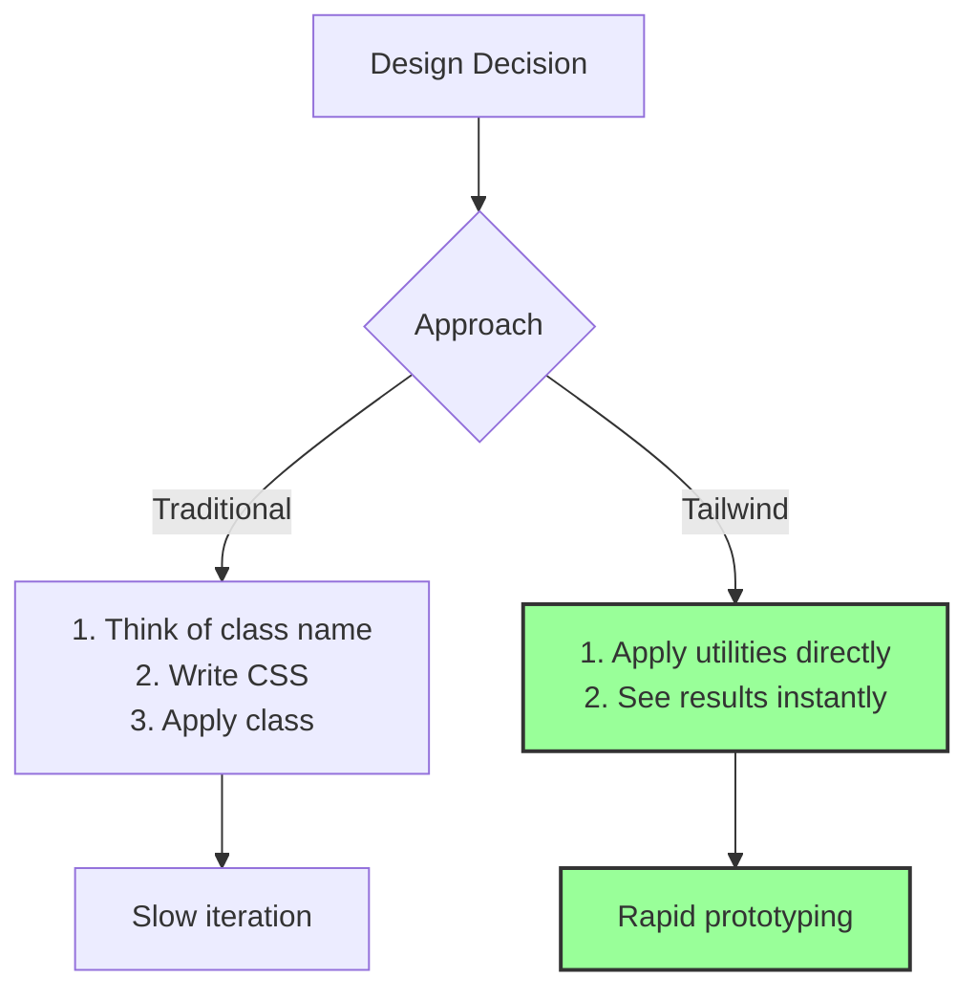
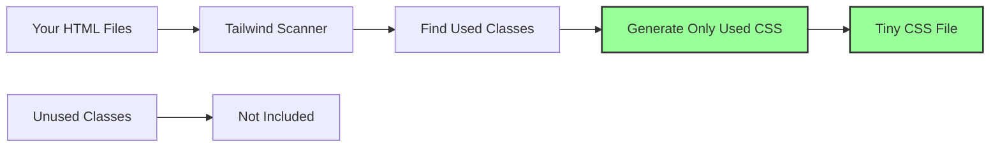

# 🎨 How Tailwind CSS Works - The Utility-First Revolution

## 📚 Table of Contents
1. [What is Tailwind CSS?](#what-is-tailwind-css)
2. [Tailwind CSS in Isolation](#tailwind-css-in-isolation)
3. [Tailwind CSS with Svelte](#tailwind-css-with-svelte)
4. [Tailwind CSS with Laravel Blade](#tailwind-css-with-laravel-blade)
5. [Tailwind CSS with React via Inertia.js](#tailwind-css-with-react-via-inertiajs)
6. [Tailwind CSS v4 - What's New](#tailwind-css-v4---whats-new)
7. [Best Practices and Patterns](#best-practices-and-patterns)

---

## 🤔 What is Tailwind CSS?

Tailwind CSS is a **utility-first CSS framework** that provides low-level utility classes to build custom designs directly in your markup.

### **Traditional CSS vs Tailwind CSS**

**Traditional Approach:**
```html
<!-- HTML -->
<div class="card">
  <h2 class="card-title">Hello World</h2>
  <p class="card-content">This is a card</p>
</div>

<!-- CSS -->
<style>
.card {
  background: white;
  border-radius: 8px;
  padding: 16px;
  box-shadow: 0 2px 4px rgba(0,0,0,0.1);
}
.card-title {
  font-size: 24px;
  font-weight: bold;
  margin-bottom: 8px;
}
.card-content {
  color: #666;
}
</style>
```

**Tailwind Approach:**
```html
<!-- All styling in HTML -->
<div class="bg-white rounded-lg p-4 shadow-md">
  <h2 class="text-2xl font-bold mb-2">Hello World</h2>
  <p class="text-gray-600">This is a card</p>
</div>
<!-- No CSS file needed! -->
```

### **The Philosophy**



---

## 🎯 Tailwind CSS in Isolation

### **Core Concepts**

**1. Utility Classes:**
```html
<!-- Each class does ONE thing -->
<div class="p-4">        <!-- padding: 1rem -->
<div class="mt-2">       <!-- margin-top: 0.5rem -->
<div class="text-blue-500"> <!-- color: rgb(59, 130, 246) -->
<div class="font-bold">  <!-- font-weight: 700 -->
```

**2. Responsive Design:**
```html
<!-- Mobile-first responsive utilities -->
<div class="text-sm md:text-base lg:text-lg">
  <!-- Small text on mobile, medium on tablet, large on desktop -->
</div>
```

**3. State Variants:**
```html
<!-- Hover, focus, and other states -->
<button class="bg-blue-500 hover:bg-blue-600 focus:ring-2 focus:ring-blue-400">
  Click me
</button>
```

**4. Dark Mode:**
```html
<!-- Automatic dark mode support -->
<div class="bg-white dark:bg-gray-800 text-black dark:text-white">
  Adapts to user preference
</div>
```

### **How Tailwind Generates CSS**



**Example Output:**
```css
/* Only includes what you use! */
.p-4 { padding: 1rem; }
.bg-blue-500 { background-color: rgb(59, 130, 246); }
.text-white { color: rgb(255, 255, 255); }
/* Unused utilities are NOT included */
```

---

## 🔷 Tailwind CSS with Svelte

### **Setup in Svelte Project**

**1. Installation:**
```bash
npm install tailwindcss @tailwindcss/vite
```

**2. Import in CSS:**
```css
/* app.css */
@import "tailwindcss";
```

**3. Use in Svelte Components:**
```svelte
<script>
  let isActive = $state(false);
</script>

<!-- Tailwind classes work perfectly -->
<button 
  class="px-4 py-2 bg-blue-500 text-white rounded hover:bg-blue-600 transition-colors"
  class:bg-green-500={isActive}
  onclick={() => isActive = !isActive}
>
  {isActive ? 'Active' : 'Click Me'}
</button>

<!-- Conditional classes with Svelte -->
<div class={`p-4 ${isActive ? 'bg-green-100' : 'bg-gray-100'}`}>
  Dynamic styling!
</div>
```

### **Svelte-Specific Patterns**

**1. Component Styling:**
```svelte
<!-- Button.svelte -->
<script>
  let { variant = 'primary', size = 'md' } = $props();
  
  const variants = {
    primary: 'bg-blue-500 hover:bg-blue-600 text-white',
    secondary: 'bg-gray-500 hover:bg-gray-600 text-white',
    danger: 'bg-red-500 hover:bg-red-600 text-white'
  };
  
  const sizes = {
    sm: 'px-2 py-1 text-sm',
    md: 'px-4 py-2',
    lg: 'px-6 py-3 text-lg'
  };
</script>

<button class={`${variants[variant]} ${sizes[size]} rounded transition-colors`}>
  <slot />
</button>
```

**2. Reactive Classes:**
```svelte
<script>
  let count = $state(0);
  let colorClass = $derived(
    count > 10 ? 'text-green-500' : 
    count > 5 ? 'text-yellow-500' : 
    'text-red-500'
  );
</script>

<p class={`text-2xl font-bold ${colorClass}`}>
  Count: {count}
</p>
```

---

## 🐘 Tailwind CSS with Laravel Blade

### **Setup in Laravel**

**1. Blade Templates:**
```blade
{{-- resources/views/welcome.blade.php --}}
<!DOCTYPE html>
<html>
<head>
    @vite(['resources/css/app.css'])
</head>
<body class="bg-gray-100">
    <div class="container mx-auto px-4 py-8">
        <h1 class="text-3xl font-bold text-gray-800 mb-4">
            Welcome to {{ config('app.name') }}
        </h1>
        
        @auth
            <div class="bg-white rounded-lg shadow p-6">
                <p class="text-gray-600">Hello, {{ auth()->user()->name }}!</p>
            </div>
        @else
            <a href="{{ route('login') }}" 
               class="inline-block px-4 py-2 bg-blue-500 text-white rounded hover:bg-blue-600">
                Login
            </a>
        @endauth
    </div>
</body>
</html>
```

**2. Blade Components:**
```blade
{{-- resources/views/components/button.blade.php --}}
@props([
    'type' => 'button',
    'variant' => 'primary'
])

@php
$classes = match($variant) {
    'primary' => 'bg-blue-500 hover:bg-blue-600 text-white',
    'secondary' => 'bg-gray-500 hover:bg-gray-600 text-white',
    'danger' => 'bg-red-500 hover:bg-red-600 text-white',
    default => 'bg-gray-500 hover:bg-gray-600 text-white'
};
@endphp

<button 
    type="{{ $type }}" 
    {{ $attributes->merge(['class' => "px-4 py-2 rounded transition-colors $classes"]) }}
>
    {{ $slot }}
</button>
```

**Usage:**
```blade
<x-button variant="primary">Save</x-button>
<x-button variant="danger">Delete</x-button>
```

---

## ⚛️ Tailwind CSS with React via Inertia.js

### **React Component Example**

```jsx
// resources/js/Pages/Users/Index.jsx
import { useState } from 'react';
import { Link } from '@inertiajs/react';

export default function UsersIndex({ users }) {
  const [search, setSearch] = useState('');
  
  const filteredUsers = users.filter(user => 
    user.name.toLowerCase().includes(search.toLowerCase())
  );
  
  return (
    <div className="container mx-auto px-4 py-8">
      {/* Search Bar */}
      <div className="mb-6">
        <input
          type="text"
          value={search}
          onChange={(e) => setSearch(e.target.value)}
          placeholder="Search users..."
          className="w-full px-4 py-2 border border-gray-300 rounded-lg focus:ring-2 focus:ring-blue-500 focus:border-transparent"
        />
      </div>
      
      {/* Users Grid */}
      <div className="grid grid-cols-1 md:grid-cols-2 lg:grid-cols-3 gap-6">
        {filteredUsers.map(user => (
          <div key={user.id} className="bg-white rounded-lg shadow-md p-6 hover:shadow-lg transition-shadow">
            <h3 className="text-xl font-semibold text-gray-800 mb-2">
              {user.name}
            </h3>
            <p className="text-gray-600 mb-4">{user.email}</p>
            <Link
              href={`/users/${user.id}`}
              className="text-blue-500 hover:text-blue-600 font-medium"
            >
              View Profile →
            </Link>
          </div>
        ))}
      </div>
    </div>
  );
}
```

### **React-Specific Patterns**

**1. Conditional Classes:**
```jsx
// Using template literals
<div className={`p-4 ${isActive ? 'bg-blue-100' : 'bg-gray-100'}`}>
  Content
</div>

// Using clsx library (recommended)
import clsx from 'clsx';

<div className={clsx(
  'p-4 rounded-lg',
  isActive && 'bg-blue-100',
  !isActive && 'bg-gray-100',
  hasError && 'border-2 border-red-500'
)}>
  Content
</div>
```

**2. Component Library:**
```jsx
// Button.jsx
export default function Button({ 
  children, 
  variant = 'primary', 
  size = 'md',
  ...props 
}) {
  const baseClasses = 'font-medium rounded-lg transition-colors focus:outline-none focus:ring-2';
  
  const variants = {
    primary: 'bg-blue-500 hover:bg-blue-600 text-white focus:ring-blue-400',
    secondary: 'bg-gray-200 hover:bg-gray-300 text-gray-800 focus:ring-gray-400',
    danger: 'bg-red-500 hover:bg-red-600 text-white focus:ring-red-400'
  };
  
  const sizes = {
    sm: 'px-3 py-1.5 text-sm',
    md: 'px-4 py-2',
    lg: 'px-6 py-3 text-lg'
  };
  
  return (
    <button 
      className={`${baseClasses} ${variants[variant]} ${sizes[size]}`}
      {...props}
    >
      {children}
    </button>
  );
}
```

---

## 🚀 Tailwind CSS v4 - What's New

### **Major Improvements**

**1. Native CSS Features:**
```css
/* v4 uses CSS variables for everything */
.text-blue-500 {
  color: var(--color-blue-500);
}

/* Enables runtime theming! */
:root {
  --color-blue-500: #3b82f6;
}
```

**2. Simplified Configuration:**
```javascript
// No more tailwind.config.js needed for basic setup!
// Just import and use
```

**3. Vite Plugin Integration:**
```javascript
// vite.config.js
import tailwindcss from '@tailwindcss/vite';

export default {
  plugins: [tailwindcss()]
}
// That's it! No PostCSS config needed
```

**4. Performance:**
- 10x faster builds
- Smaller CSS output
- Better tree-shaking

---

## 💡 Best Practices and Patterns

### **1. Component Extraction**

**When to Extract:**
```html
<!-- ❌ Repetitive -->
<button class="px-4 py-2 bg-blue-500 text-white rounded hover:bg-blue-600">Save</button>
<button class="px-4 py-2 bg-blue-500 text-white rounded hover:bg-blue-600">Update</button>
<button class="px-4 py-2 bg-blue-500 text-white rounded hover:bg-blue-600">Submit</button>

<!-- ✅ Extract to component -->
<Button>Save</Button>
<Button>Update</Button>
<Button>Submit</Button>
```

### **2. Design Tokens**

```css
/* Create consistent spacing/sizing */
:root {
  --spacing-xs: 0.5rem;  /* 8px */
  --spacing-sm: 1rem;    /* 16px */
  --spacing-md: 1.5rem;  /* 24px */
  --spacing-lg: 2rem;    /* 32px */
  --spacing-xl: 3rem;    /* 48px */
}
```

### **3. Responsive Patterns**

```html
<!-- Mobile-first approach -->
<div class="
  grid grid-cols-1      /* Mobile: 1 column */
  md:grid-cols-2        /* Tablet: 2 columns */
  lg:grid-cols-3        /* Desktop: 3 columns */
  xl:grid-cols-4        /* Large: 4 columns */
  gap-4
">
  <!-- Grid items -->
</div>
```

### **4. Accessibility**

```html
<!-- Always include focus states -->
<button class="
  bg-blue-500 
  hover:bg-blue-600 
  focus:outline-none 
  focus:ring-2 
  focus:ring-blue-400 
  focus:ring-offset-2
">
  Accessible Button
</button>

<!-- Screen reader utilities -->
<span class="sr-only">Loading...</span>
<div aria-hidden="true" class="animate-spin">🔄</div>
```

### **5. Performance Tips**

```html
<!-- Use arbitrary values sparingly -->
<!-- ❌ Avoid -->
<div class="w-[437px] h-[289px] mt-[23px]">

<!-- ✅ Prefer standard utilities -->
<div class="w-96 h-64 mt-6">
```

---

## 🎓 Key Takeaways

### **Why Tailwind CSS?**

1. **Speed**: Build UIs faster without context switching
2. **Consistency**: Design system built-in with standardized spacing
3. **Flexibility**: Customize everything or use defaults
4. **Performance**: Only ship CSS you actually use
5. **Maintenance**: No more naming things or CSS conflicts

### **Framework Integration Summary**

| Framework | Key Benefit | Special Features |
|-----------|------------|------------------|
| **Svelte** | Direct class binding | `class:` directive |
| **React** | Component composition | `clsx` for conditions |
| **Vue** | Template simplicity | `:class` binding |
| **Blade** | Server-side power | `@props` and components |

### **The Tailwind Philosophy**

```
Write HTML → Add utility classes → See results → Ship it!
```

No more:
- Naming CSS classes
- Writing separate CSS files  
- Dealing with specificity issues
- Worrying about dead CSS

---

**Remember**: Tailwind CSS is not about memorizing classes, it's about understanding the system and using IDE autocomplete to build rapidly! 