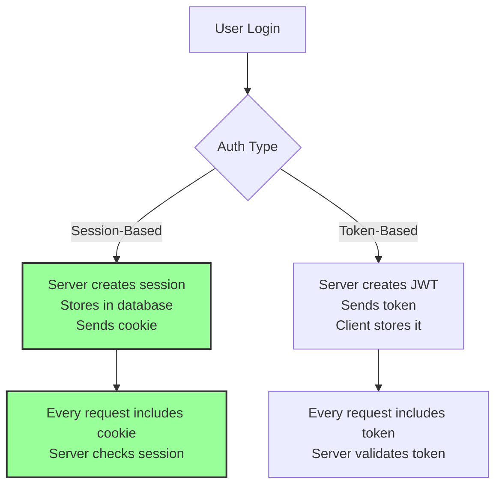
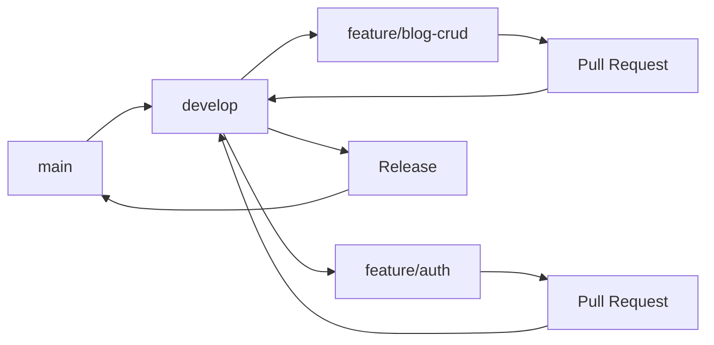

# 🌟 Modern Web Development Essentials - Beyond the Basics

## 📚 Table of Contents
1. [Authentication in Modern Apps](#authentication-in-modern-apps)
2. [Database Design & Eloquent ORM](#database-design--eloquent-orm)
3. [Development Workflow & Git](#development-workflow--git)
4. [Testing & Quality Assurance](#testing--quality-assurance)
5. [Deployment & Production](#deployment--production)
6. [Performance Optimization](#performance-optimization)
7. [Security Best Practices](#security-best-practices)

---

## 🔐 Authentication in Modern Apps

### **Session-Based vs Token-Based Authentication**



### **Why We Use Session-Based with Inertia.js**

**1. Simplicity:**
```php
// Laravel Controller - It just works!
public function login(Request $request) {
    if (Auth::attempt($request->only('email', 'password'))) {
        return redirect('/dashboard');
    }
    return back()->withErrors(['email' => 'Invalid credentials']);
}
```

**2. Security:**
- CSRF protection built-in
- Sessions stored server-side
- Automatic expiration
- No token storage concerns

**3. Integration:**
```svelte
<!-- Svelte Component - Auth data automatically available -->
<script>
  let { auth } = $props();
</script>

{#if auth.user}
  <p>Welcome, {auth.user.name}!</p>
{:else}
  <a href="/login">Please login</a>
{/if}
```

### **Password Security**

```php
// Laravel handles everything!
// 1. Automatic hashing
$user->password = 'plain-text-password';
// Becomes: $2y$10$92IXUNpkjO0rOQ5byMi.Ye4oKoEa3Ro9llC/.og/at2.uheWG/igi

// 2. Verification
if (Hash::check('plain-text-password', $user->password)) {
    // Password is correct
}

// 3. Password reset tokens
Password::sendResetLink(['email' => $email]);
```

---

## 🗄️ Database Design & Eloquent ORM

### **Understanding Migrations**

```php
// database/migrations/create_blog_posts_table.php
Schema::create('blog_posts', function (Blueprint $table) {
    $table->id();                          // Primary key
    $table->foreignId('user_id')           // Foreign key
          ->constrained()                   // References users table
          ->onDelete('cascade');            // Delete posts when user deleted
    $table->string('title');                // VARCHAR(255)
    $table->text('content');                // TEXT field
    $table->enum('status', ['draft', 'published']);
    $table->timestamps();                   // created_at, updated_at
    
    // Indexes for performance
    $table->index('status');
    $table->index(['user_id', 'status']);
});
```

### **Eloquent Relationships**

```php
// User Model
class User extends Authenticatable {
    // One user has many posts
    public function posts() {
        return $this->hasMany(BlogPost::class);
    }
}

// BlogPost Model
class BlogPost extends Model {
    // Each post belongs to one user
    public function user() {
        return $this->belongsTo(User::class);
    }
    
    // Scopes for common queries
    public function scopePublished($query) {
        return $query->where('status', 'published');
    }
}

// Usage
$user = User::find(1);
$posts = $user->posts()->published()->get();
```

### **Query Optimization**

```php
// ❌ N+1 Problem
$posts = BlogPost::all();
foreach ($posts as $post) {
    echo $post->user->name; // Queries database each time!
}

// ✅ Eager Loading
$posts = BlogPost::with('user')->get();
foreach ($posts as $post) {
    echo $post->user->name; // No additional queries!
}
```

---

## 🔄 Development Workflow & Git

### **Git Workflow for Teams**



### **Essential Git Commands**

```bash
# Start new feature
git checkout -b feature/user-profile

# Save work in progress
git add .
git commit -m "feat: add user profile page"

# Update from main branch
git checkout develop
git pull origin develop
git checkout feature/user-profile
git merge develop

# Push and create PR
git push origin feature/user-profile
```

### **Commit Message Convention**

```bash
# Format: type(scope): description

feat(auth): add password reset functionality
fix(blog): correct pagination on index page
docs(readme): update installation instructions
style(ui): improve button hover states
refactor(api): simplify user controller
test(auth): add login validation tests
chore(deps): update npm packages
```

---

## 🧪 Testing & Quality Assurance

### **Types of Tests**

**1. Unit Tests:**
```php
// tests/Unit/UserTest.php
public function test_user_can_have_posts() {
    $user = User::factory()->create();
    $post = BlogPost::factory()->create(['user_id' => $user->id]);
    
    $this->assertTrue($user->posts->contains($post));
}
```

**2. Feature Tests:**
```php
// tests/Feature/AuthTest.php
public function test_user_can_login() {
    $user = User::factory()->create([
        'password' => bcrypt('password123')
    ]);
    
    $response = $this->post('/login', [
        'email' => $user->email,
        'password' => 'password123'
    ]);
    
    $response->assertRedirect('/dashboard');
    $this->assertAuthenticated();
}
```

**3. Browser Tests (Dusk):**
```php
// tests/Browser/BlogTest.php
public function test_user_can_create_post() {
    $this->browse(function (Browser $browser) {
        $browser->loginAs(User::find(1))
                ->visit('/blog/create')
                ->type('title', 'My New Post')
                ->type('content', 'Post content...')
                ->press('Publish')
                ->assertPathIs('/blog')
                ->assertSee('My New Post');
    });
}
```

### **Code Quality Tools**

```bash
# PHP Code Style
php artisan pint

# JavaScript/Svelte Linting
npm run lint

# Run all tests
php artisan test

# Check code coverage
php artisan test --coverage
```

---

## 🚀 Deployment & Production

### **Pre-Deployment Checklist**

```bash
# 1. Environment Configuration
cp .env.example .env.production
# Edit with production values

# 2. Optimize Laravel
php artisan config:cache
php artisan route:cache
php artisan view:cache
php artisan optimize

# 3. Build Frontend Assets
npm run build

# 4. Database
php artisan migrate --force

# 5. Set Permissions
chmod -R 755 storage
chmod -R 755 bootstrap/cache
```

### **Server Requirements**

```nginx
# Nginx Configuration
server {
    listen 80;
    server_name yourdomain.com;
    root /var/www/html/public;

    add_header X-Frame-Options "SAMEORIGIN";
    add_header X-Content-Type-Options "nosniff";

    index index.php;

    location / {
        try_files $uri $uri/ /index.php?$query_string;
    }

    location ~ \.php$ {
        fastcgi_pass unix:/var/run/php/php8.2-fpm.sock;
        fastcgi_param SCRIPT_FILENAME $realpath_root$fastcgi_script_name;
        include fastcgi_params;
    }

    location ~ /\.(?!well-known).* {
        deny all;
    }
}
```

### **Environment Variables**

```env
# Production .env
APP_ENV=production
APP_DEBUG=false
APP_URL=https://yourdomain.com

DB_CONNECTION=mysql
DB_HOST=your-db-host
DB_DATABASE=your_database
DB_USERNAME=your_username
DB_PASSWORD=strong_password

MAIL_MAILER=smtp
MAIL_HOST=smtp.mailtrap.io
MAIL_PORT=2525

SESSION_DRIVER=database
CACHE_DRIVER=redis
QUEUE_CONNECTION=redis
```

---

## ⚡ Performance Optimization

### **Frontend Optimization**

**1. Code Splitting:**
```javascript
// Lazy load heavy components
const HeavyComponent = lazy(() => import('./HeavyComponent.svelte'));
```

**2. Image Optimization:**
```svelte
<!-- Use responsive images -->
<picture>
  <source srcset="image-mobile.webp" media="(max-width: 768px)">
  <source srcset="image-desktop.webp">
  
</picture>
```

### **Backend Optimization**

**1. Database Queries:**
```php
// Cache expensive queries
$posts = Cache::remember('popular-posts', 3600, function () {
    return BlogPost::with('user')
                   ->withCount('comments')
                   ->orderBy('views', 'desc')
                   ->take(10)
                   ->get();
});
```

**2. Queue Long Tasks:**
```php
// Don't make users wait
dispatch(new ProcessVideoJob($video))->onQueue('videos');
```

---

## 🔒 Security Best Practices

### **Common Vulnerabilities & Prevention**

**1. SQL Injection:**
```php
// ❌ NEVER do this
$users = DB::select("SELECT * FROM users WHERE email = '$email'");

// ✅ Use parameter binding
$users = DB::select("SELECT * FROM users WHERE email = ?", [$email]);

// ✅ Or better, use Eloquent
$users = User::where('email', $email)->get();
```

**2. XSS (Cross-Site Scripting):**
```svelte
<!-- ❌ Dangerous -->
{@html userContent}

<!-- ✅ Safe (default behavior) -->
{userContent}

<!-- If HTML needed, sanitize first -->
{@html DOMPurify.sanitize(userContent)}
```

**3. CSRF Protection:**
```svelte
<!-- Inertia.js handles this automatically! -->
<!-- All POST/PUT/DELETE requests include CSRF token -->
```

### **Security Headers**

```php
// app/Http/Middleware/SecurityHeaders.php
public function handle($request, Closure $next) {
    $response = $next($request);
    
    $response->headers->set('X-Content-Type-Options', 'nosniff');
    $response->headers->set('X-Frame-Options', 'DENY');
    $response->headers->set('X-XSS-Protection', '1; mode=block');
    $response->headers->set('Strict-Transport-Security', 'max-age=31536000');
    
    return $response;
}
```

---

## 🎓 Key Takeaways

### **Modern Development Principles**

1. **Security First**: Always validate, sanitize, and protect
2. **Performance Matters**: Optimize queries, cache wisely
3. **Test Everything**: Unit, feature, and browser tests
4. **Version Control**: Meaningful commits, proper branching
5. **Documentation**: Code should be self-documenting + comments
6. **Continuous Learning**: Web dev evolves rapidly

### **The Full Stack Journey**

```
Frontend (Svelte) → Bridge (Inertia.js) → Backend (Laravel) → Database (MySQL/PostgreSQL)
     ↓                    ↓                     ↓                      ↓
  UI/UX Logic      SPA Navigation        Business Logic          Data Storage
```

### **Remember**

- **Start Simple**: Get it working, then optimize
- **Follow Conventions**: Framework patterns exist for good reasons
- **Ask for Help**: Community is friendly and helpful
- **Keep Learning**: Every project teaches something new

---

**Your journey in modern web development has just begun. Keep building, keep learning, and most importantly, have fun creating amazing things!** 🚀 