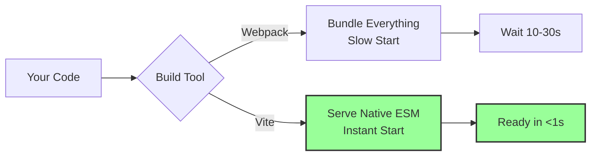
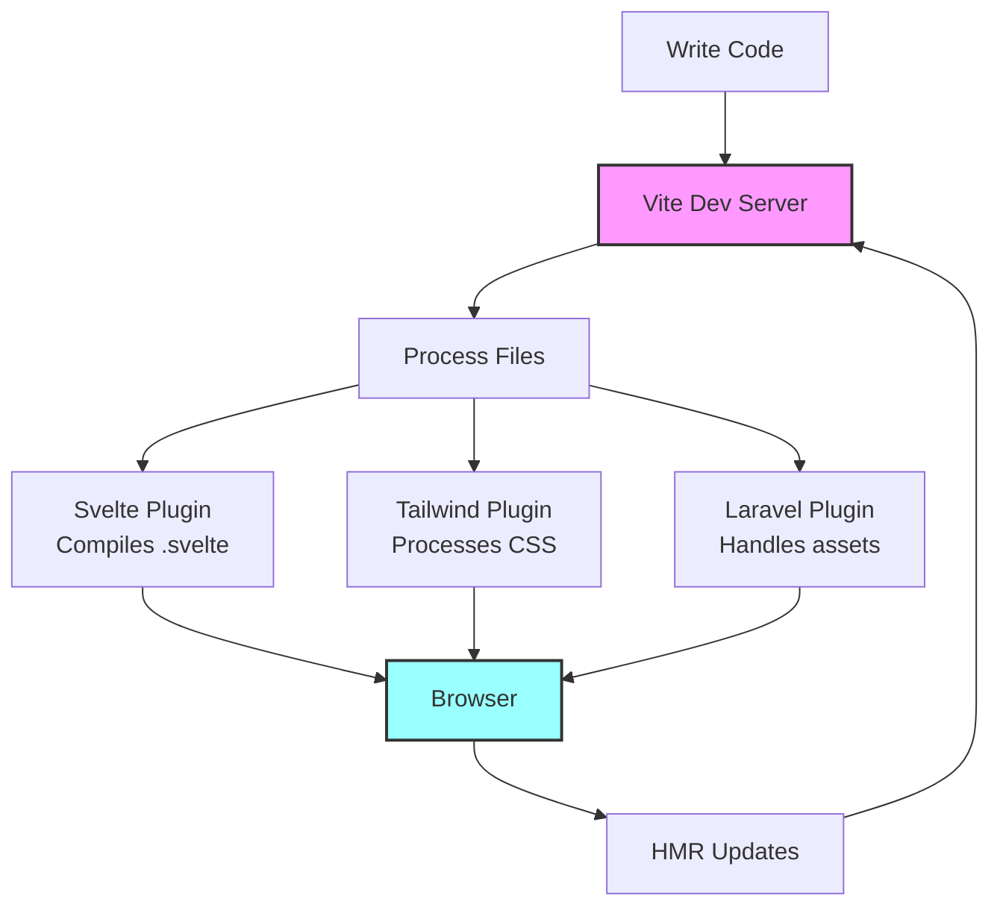

# 🚀 Why Vite and Our Dependencies Matter - Understanding Modern Web Tooling

## 📚 Table of Contents
1. [Why Vite?](#why-vite)
2. [Understanding package.json Dependencies](#understanding-packagejson-dependencies)
3. [Understanding composer.json Dependencies](#understanding-composerjson-dependencies)
4. [How These Tools Work Together](#how-these-tools-work-together)
5. [The Build Process Explained](#the-build-process-explained)

---

## ⚡ Why Vite?

### **What is Vite?**
Vite (French for "quick") is a **modern build tool** that provides:
- ⚡ Lightning-fast development server
- 🔥 Hot Module Replacement (HMR)
- 📦 Optimized production builds
- 🎯 Zero-config for most frameworks

### **Vite vs Traditional Build Tools**



### **Why Vite is Revolutionary**

**1. Development Speed:**
```javascript
// Traditional (Webpack): Bundles everything before serving
// Start time: 10-30 seconds for large projects

// Vite: Serves files as native ES modules
// Start time: <1 second regardless of project size
```

**2. Hot Module Replacement (HMR):**
```svelte
<!-- Change this component -->
<h1>Hello World</h1>

<!-- Vite updates ONLY this component in <50ms -->
<!-- Webpack might take 2-5 seconds -->
```

**3. Production Optimization:**
- Automatic code splitting
- CSS code splitting
- Asset optimization
- Tree shaking
- Minification

---

## 📦 Understanding package.json Dependencies

Let's break down each dependency and why it's essential:

### **Core Dependencies**

```json
{
  "dependencies": {
    "@inertiajs/svelte": "^2.0.11",
    "svelte": "^5.33.18",
    "tailwindcss": "^4.1.8",
    "nprogress": "^0.2.0",
    "axios": "^1.8.2"
  }
}
```

#### **1. @inertiajs/svelte (^2.0.11)**
**Purpose**: Bridge between Laravel backend and Svelte frontend
```javascript
// Enables this magic:
import { router, Link } from '@inertiajs/svelte';

// Navigate without page reload
router.visit('/users');

// Submit forms with progress
router.post('/users', formData);
```

#### **2. svelte (^5.33.18)**
**Purpose**: The UI framework that compiles to vanilla JS
```svelte
<!-- Write this -->
<script>
  let count = $state(0);
</script>
<button onclick={() => count++}>{count}</button>

<!-- Compiles to optimized vanilla JS -->
```

#### **3. tailwindcss (^4.1.8)**
**Purpose**: Utility-first CSS framework
```html
<!-- Instead of writing CSS -->
<div class="my-custom-card">...</div>
<style>
  .my-custom-card { 
    padding: 1rem; 
    background: white; 
    border-radius: 0.5rem; 
  }
</style>

<!-- Write utilities directly -->
<div class="p-4 bg-white rounded-lg">...</div>
```

#### **4. nprogress (^0.2.0)**
**Purpose**: Slim progress bar for navigation
```javascript
// Automatically shows during Inertia navigation
// Users see visual feedback during page transitions
```

#### **5. axios (^1.8.2)**
**Purpose**: HTTP client for API requests
```javascript
// Clean API for HTTP requests
const response = await axios.get('/api/data');
// Better than fetch() with interceptors, defaults, etc.
```

### **Development Dependencies**

```json
{
  "devDependencies": {
    "@tailwindcss/vite": "^4.1.8",
    "@sveltejs/vite-plugin-svelte": "^5.1.0",
    "autoprefixer": "^10.4.21",
    "concurrently": "^9.0.1",
    "laravel-vite-plugin": "^1.2.0",
    "postcss": "^8.5.4",
    "vite": "^6.2.4"
  }
}
```

#### **1. @tailwindcss/vite (^4.1.8)**
**Purpose**: Direct Tailwind CSS integration with Vite
```javascript
// No postcss.config.js needed!
// Tailwind CSS v4 works directly with Vite
```

#### **2. @sveltejs/vite-plugin-svelte (^5.1.0)**
**Purpose**: Enables Svelte compilation in Vite
```javascript
// Handles:
// - .svelte file compilation
// - HMR for Svelte components
// - Production optimizations
```

#### **3. autoprefixer (^10.4.21)**
**Purpose**: Adds vendor prefixes to CSS
```css
/* You write */
.example {
  user-select: none;
}

/* Autoprefixer adds */
.example {
  -webkit-user-select: none;
  -moz-user-select: none;
  user-select: none;
}
```

#### **4. concurrently (^9.0.1)**
**Purpose**: Run multiple commands simultaneously
```json
// In package.json scripts:
"dev": "concurrently \"npm run vite\" \"php artisan serve\""
// Runs both Vite and Laravel in one terminal!
```

#### **5. laravel-vite-plugin (^1.2.0)**
**Purpose**: Integrates Vite with Laravel
```javascript
// Enables @vite directive in Blade
// Handles manifest generation
// Configures dev server proxy
```

#### **6. postcss (^8.5.4)**
**Purpose**: CSS transformation tool
```css
/* Required for Tailwind CSS processing */
/* Transforms modern CSS to browser-compatible CSS */
```

---

## 🐘 Understanding composer.json Dependencies

### **Core PHP Dependencies**

```json
{
  "require": {
    "php": "^8.2",
    "inertiajs/inertia-laravel": "^2.0",
    "laravel/framework": "^12.0",
    "laravel/tinker": "^2.10.1"
  }
}
```

#### **1. php (^8.2)**
**Purpose**: Minimum PHP version requirement
```php
// Enables modern PHP features:
// - Named arguments
// - Union types
// - Match expressions
// - Nullsafe operator
```

#### **2. inertiajs/inertia-laravel (^2.0)**
**Purpose**: Server-side Inertia.js adapter
```php
// Enables this in controllers:
return Inertia::render('Users/Index', [
    'users' => User::all()
]);

// Instead of:
return view('users.index', ['users' => User::all()]);
```

#### **3. laravel/framework (^12.0)**
**Purpose**: The core Laravel framework
```php
// Provides:
// - Routing
// - Database ORM (Eloquent)
// - Authentication
// - Validation
// - And 100+ more features
```

#### **4. laravel/tinker (^2.10.1)**
**Purpose**: REPL for Laravel
```bash
php artisan tinker
# Interactive shell to test code
>>> User::count()
=> 42
```

### **Development Dependencies**

```json
{
  "require-dev": {
    "fakerphp/faker": "^1.23",
    "laravel/pail": "^1.2.2",
    "laravel/pint": "^1.13",
    "laravel/sail": "^1.41",
    "mockery/mockery": "^1.6",
    "nunomaduro/collision": "^8.6",
    "phpunit/phpunit": "^11.5.3"
  }
}
```

#### **1. fakerphp/faker (^1.23)**
**Purpose**: Generate fake data for testing
```php
$faker = Faker\Factory::create();
$faker->name;    // 'John Doe'
$faker->email;   // 'john@example.com'
$faker->text;    // Lorem ipsum...
```

#### **2. laravel/pail (^1.2.2)**
**Purpose**: Real-time log viewer
```bash
php artisan pail
# See logs in real-time with beautiful formatting
```

#### **3. laravel/pint (^1.13)**
**Purpose**: Code style fixer
```bash
php artisan pint
# Automatically formats your PHP code to Laravel standards
```

#### **4. laravel/sail (^1.41)**
**Purpose**: Docker development environment
```bash
./vendor/bin/sail up
# Full Docker environment with PHP, MySQL, Redis, etc.
```

#### **5. mockery/mockery (^1.6)**
**Purpose**: Mocking framework for tests
```php
$mock = Mockery::mock(UserService::class);
$mock->shouldReceive('find')->andReturn($user);
```

#### **6. nunomaduro/collision (^8.6)**
**Purpose**: Beautiful error reporting
```bash
# Instead of ugly stack traces
# Get beautiful, readable error messages
```

#### **7. phpunit/phpunit (^11.5.3)**
**Purpose**: Testing framework
```php
public function test_user_can_login()
{
    $response = $this->post('/login', [
        'email' => 'test@example.com',
        'password' => 'password'
    ]);
    
    $response->assertRedirect('/dashboard');
}
```

---

## 🔗 How These Tools Work Together

### **The Development Flow**



### **Example: Saving a Svelte Component**

1. **You save** `Button.svelte`
2. **Vite detects** file change
3. **Svelte plugin** compiles component
4. **Vite sends** update to browser
5. **Browser updates** without reload
6. **Total time**: ~50ms

### **Production Build Process**

```bash
npm run build
```

1. **Vite** starts build process
2. **Svelte plugin** compiles all components
3. **Tailwind plugin** generates final CSS
4. **Vite** optimizes:
   - Tree shaking (removes unused code)
   - Minification (makes files smaller)
   - Code splitting (separate bundles)
   - Asset optimization (images, fonts)
5. **Laravel plugin** generates manifest
6. **Output**: Optimized files in `public/build/`

---

## 🏗️ The Build Process Explained

### **Development vs Production**

**Development Mode:**
```javascript
// vite.config.js effect
{
  server: {
    host: true,  // Network access
    hmr: {
      host: 'localhost'  // Fast updates
    }
  }
}
```
- No bundling (uses native ES modules)
- Source maps for debugging
- HMR for instant updates
- Verbose error messages

**Production Mode:**
```javascript
// vite.config.js effect
{
  build: {
    rollupOptions: {
      output: {
        manualChunks: {
          svelte: ['svelte'],
          inertia: ['@inertiajs/svelte']
        }
      }
    }
  }
}
```
- Full optimization
- Code splitting
- Minification
- No source maps
- Compressed assets

### **Why This Stack is Powerful**

1. **Speed**: Vite + Svelte = Fastest possible development
2. **Simplicity**: Inertia.js = No API complexity
3. **Modern**: Latest versions of everything
4. **Developer Experience**: HMR, great errors, fast builds
5. **Production Ready**: Optimized, secure, scalable

---

## 🎓 Key Takeaways

### **Essential Understanding**

1. **Vite** = Modern build tool that makes development fast
2. **Dependencies** = Each serves a specific, important purpose
3. **Dev Dependencies** = Tools that help during development
4. **Integration** = All tools work together seamlessly

### **Why This Matters**

- **Fast Development**: Save hours with instant updates
- **Better Code**: Tools help write cleaner code
- **Production Quality**: Optimized output for users
- **Modern Standards**: Using latest best practices

### **The Magic Formula**

```
Vite (Build Tool)
+ Svelte (UI Framework)  
+ Inertia.js (SPA Bridge)
+ Laravel (Backend)
+ Tailwind (Styling)
= Modern Full-Stack Development
```

---

**Remember**: Each dependency was carefully chosen to solve specific problems and make development faster, easier, and more enjoyable! 